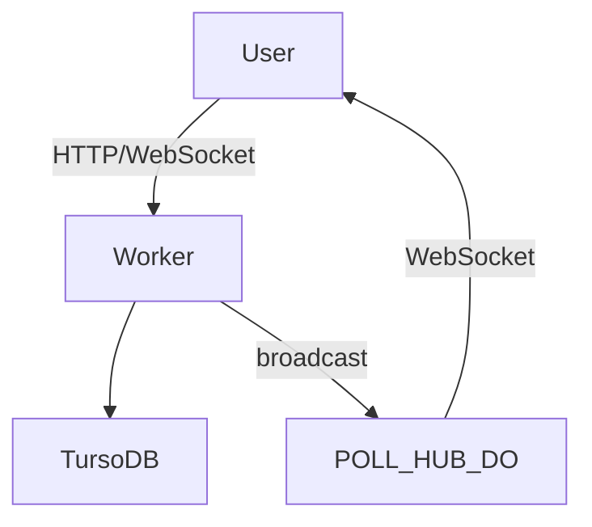

# OpenPoll

> OpenPoll is a free and open-source platform to create and share polls. Use moderation features to share your polls during a live event or meetings.

OpenPoll uses SQLite and Cloudflare Durable Objects to create fast real-time polls.
Build on top of TRPC, Shadcn/UI and Turso.

View Example Poll: [https://openpoll.app/poll/trU02FHXws](https://openpoll.app/poll/trU02FHXws)

## Tech Stack

OpenPoll is build on top of Astro. It uses the following technologies to create a combination of a static and dynamic website. 
- [Astro](https://astro.build/) as the main framework.
- [React](https://reactjs.org/) for the dynamic parts of the website. 
- TRPC for the API. Trpc is a framework that allows you to create a type-safe API. In OpenPoll TRPC APIs get called from Astro componentens on the server side and from react components on the client side.
- [better-auth](https://github.com/pilcrowOnPaper/better-auth) for authentication - A lightweight, framework-agnostic auth library.
- shadcn/ui - Beautifully designed components built with Radix UI and Tailwind CSS.
- [Tailwind CSS](https://tailwindcss.com/) for styling.
- Drizzle as the DB-ORM
- SQLite as the database. The DB is hosted on Turso (libSQL) or you can use a local SQLite file.

## Architecture

## Self Hosting

OpenPoll is deployed on Cloudflare Pages. The real-time features are handled by a Durable Object called `POLL_HUB`.

To deploy your own instance:

1. Deploy the Durable Object located in `openpoll-do` with `wrangler deploy`.
2. Deploy the main application to Cloudflare Pages using `pnpm run deploy`.

For local development run `pnpm dev` in the project root and `pnpm dev` in `openpoll-do` to start the Durable Object locally.

